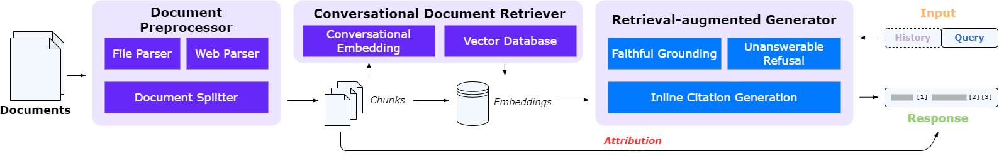

# TruthReader — Chatbot Trợ lý Tài liệu với Trích dẫn Nguồn Đáng tin cậy

[](https://www.python.org/downloads/)
[](https://github.com/huggingface/transformers)
[](https://opensource.org/licenses/MIT)

> **Đồ án CS222.Q22** — Tái lập và mở rộng hệ thống TruthReader (EMNLP 2024)


---

## 1. TruthReader là gì?

**TruthReader** là một chatbot hỏi-đáp trên tài liệu (document QA). Bạn upload tài liệu lên, đặt câu hỏi, và hệ thống sẽ trả lời dựa trên nội dung tài liệu — kèm theo **trích dẫn chính xác** tới đoạn văn nguồn.

### Vấn đề mà TruthReader giải quyết

Các chatbot AI thông thường (ChatGPT, Gemini...) khi đọc tài liệu thường gặp 2 vấn đề:

| Vấn đề | Mô tả |
| :--- | :--- |
| **Hallucination** | AI "bịa" thông tin không có trong tài liệu, người dùng không biết đâu là thật |
| **Không kiểm chứng được** | Câu trả lời dài, tài liệu cũng dài → không biết AI lấy thông tin từ đâu |

**TruthReader** giải quyết bằng cách:

```
Câu hỏi: "GDP tăng bao nhiêu phần trăm?"

Câu trả lời thường: "GDP tăng 6.5% trong năm 2023."
                    → Đúng hay sai? Lấy từ đâu? Không biết.

Câu trả lời TruthReader: "GDP tăng 6.5% trong năm 2023 [2]."
                          → Click [2] → nhảy tới đoạn văn gốc trong tài liệu
                          → Attribution score: 🟦 92% (độ tin cậy cao)
```

### 5 khả năng chính

| # | Khả năng | Chi tiết |
| :---: | :--- | :--- |
| 1 | **Inline Citation** | Mỗi câu trong phản hồi kèm tag `[1]`, `[2]`... trỏ tới đoạn tài liệu gốc. Click vào tag → nhảy tới đoạn đó. |
| 2 | **Attribution Score** | Thanh điểm đo độ nhất quán giữa câu trả lời và nguồn trích dẫn (dùng ROUGE-1). Đỏ = thấp, Vàng = trung bình, Xanh = cao. |
| 3 | **Từ chối trả lời** | Khi tài liệu không chứa thông tin liên quan, model nói "Xin lỗi, tài liệu không chứa thông tin này" thay vì bịa câu trả lời. |
| 4 | **Đa tài liệu & định dạng** | Upload tối đa 50 file cùng lúc: PDF (có OCR), DOCX, TXT, Markdown, hoặc nhập URL web. |
| 5 | **Hội thoại đa lượt** | Hỏi tiếp câu follow-up, hệ thống nhớ ngữ cảnh hội thoại trước đó để tìm đúng thông tin. |

---

## 2. Cách hệ thống hoạt động



Hệ thống gồm 3 bước xử lý theo pipeline:

```
┌─────────────────┐     ┌───────────────────────────┐     ┌─────────────────────────────┐
│  1. TIỀN XỬ LÝ  │ ──→ │  2. TÌM KIẾM (Retriever)  │ ──→ │  3. SINH CÂU TRẢ LỜI (Gen)  │
│                 │     │                           │     │                             │
│ Upload tài liệu │     │ Tìm 4 đoạn văn liên quan  │     │ Đọc 4 đoạn + sinh answer    │
│ → Chia nhỏ      │     │ nhất với câu hỏi          │     │ kèm citation [1][2]...      │
│ → Tạo embedding │     │ (có xét lịch sử hội thoại)│     │ + attribution score         │
└─────────────────┘     └───────────────────────────┘     └─────────────────────────────┘
```

| Bước | Thành phần | Model sử dụng | Vai trò |
| :---: | :--- | :--- | :--- |
| 1 | **Document Preprocessor** | Nougat OCR (cho PDF) | Parse file → chia thành chunks → tạo vector embedding |
| 2 | **Conversational Retriever** | BGE-M3 (fine-tuned) | Nhận câu hỏi + lịch sử → tìm top-4 chunks liên quan nhất |
| 3 | **RAG Generator** | Qwen1.5-14B hoặc Mixtral-7Bx2 (LoRA) | Đọc chunks + sinh câu trả lời có inline citation |

**Chi tiết kỹ thuật quan trọng:**

- **Retriever**: Ghép câu hỏi hiện tại với lịch sử hội thoại (theo thứ tự ngược) → encode thành vector → tìm kiếm nearest neighbor trong Faiss vector database
- **Generator**: Nhận 4 chunks được đánh số `[1]`, `[2]`, `[3]`, `[4]` → sinh câu trả lời, mỗi câu kèm citation trỏ tới chunk tương ứng
- **Refusal**: Nếu 4 chunks không chứa đủ thông tin → generator trả lời từ chối kèm giải thích

---

## 3. Quick Start — Chạy Demo

> **Cách nhanh nhất**: Mở notebook trên Colab/Kaggle, chạy từ trên xuống dưới.

### Bước 1: Mở notebook

Mở [`TruthReader_demo.ipynb`](TruthReader_demo.ipynb) trên:
- **Google Colab Pro** — chọn GPU A100 hoặc L4
- **Kaggle** — Settings → Accelerator → GPU T4 x2

### Bước 2: Chạy tuần tự

| Step | Làm gì | Thời gian |
| :---: | :--- | :--- |
| 0 | Kiểm tra GPU (cần VRAM ≥ 16 GB) | 5 giây |
| 1 | Clone repo + cài thư viện | 3–5 phút |
| ⚠️ | **Restart Runtime** (bắt buộc) | — |
| 1b | Verify packages sau restart | 10 giây |
| 2 | Tải 3 models (~32 GB) | 10–20 phút |
| 3 | Khởi động vLLM server | 1–2 phút |
| 4 | Launch Gradio UI | 30 giây |

### Bước 3: Chat

Khi thấy link `https://xxxxx.gradio.live` → click vào → upload tài liệu → đặt câu hỏi.

---

## 4. Mục tiêu Đồ án

> **Câu hỏi nghiên cứu**: *Liệu pipeline huấn luyện của TruthReader có duy trì hiệu suất khi thay đổi dữ liệu huấn luyện?*

Chúng tôi tái lập toàn bộ pipeline gốc, sau đó thay thế dữ liệu huấn luyện Retriever (từ RefGPT → CORAL) để kiểm tra tính tổng quát hóa.

| Giai đoạn | Công việc | Output |
| :---: | :--- | :--- |
| 1 | Tái lập pipeline huấn luyện (Retriever + Generator) | Model fine-tuned giống tác giả |
| 2 | Thay dataset Retriever: RefGPT → CORAL | Model retriever mới |
| 3 | Đánh giá so sánh 2 retriever + generator | Bảng kết quả + phân tích |

### Thành viên nhóm

| STT | Họ và Tên | MSSV |
| :---: | :--- | :---: |
| 1 | Phạm Thị Ngọc Bích | 23520148 |
| 2 | Trần Kỷ Diệu | 23520290 |
| 3 | Trịnh Trân Trân | 23521624 |

**Môn học**: CS222.Q22 — GV: TS. Nguyễn Thị Quý

> 📄 **Paper gốc**: [TruthReader: Towards Trustworthy Document Assistant Chatbot with Reliable Attribution](https://aclanthology.org/2024.emnlp-demo.10.pdf) (EMNLP 2024 Demo)

---

## 5. Tái lập Huấn luyện (Reproduce)

> Huấn luyện chạy trên **[Modal](https://modal.com/)** — nền tảng cloud GPU (A100 40GB). Free tier: $30/tháng.

### Cài đặt Modal

```bash
pip install modal
modal token new       # Đăng nhập qua trình duyệt
modal token verify    # Xác nhận
```

---

### 5.1 Fine-tune Retriever

> **Notebook**: `Reproduce/Finetune_Retriever.ipynb`

**Mục tiêu**: Dạy model BGE-M3 tìm đúng đoạn văn liên quan dựa trên câu hỏi + lịch sử hội thoại.

**Cách hoạt động của Retriever:**

```
Input:  "# QUESTION: GDP tăng bao nhiêu?
         # HISTORY:
         A: Bài báo này nói về gì?
         B: Bài báo phân tích kinh tế Việt Nam 2023..."

Output: Vector 768 chiều → tìm nearest neighbor trong database chunks
```

**Dữ liệu huấn luyện** — 4 loại training pair (data augmentation):

| Loại | Mô tả | Mục đích |
| :--- | :--- | :--- |
| Không history | Chỉ câu hỏi đơn lẻ | Xử lý câu hỏi đầu tiên |
| Relevant history | Lịch sử hội thoại đúng chủ đề | Tận dụng ngữ cảnh |
| Irrelevant history | Lịch sử random từ cuộc trò chuyện khác | Học bỏ qua noise |
| Topic transition | Ghép irrelevant + relevant | Xử lý khi người dùng đổi chủ đề |

**Cấu hình**:

| Tham số | Giá trị |
| :--- | :--- |
| Base Model | BAAI/bge-m3 |
| Dataset | ariya2357/CORAL (~59K turns) |
| Loss | InfoNCE (MultipleNegativesRankingLoss) |
| Epochs | 1 |
| Batch Size | 32 |
| Learning Rate | 2e-5 |
| Max Seq Length | 512 |
| GPU | A100 40GB (~1 giờ) |

**Chạy**:
```bash
modal run _modal_finetune_retriever.py \
    --hf-token YOUR_TOKEN \
    --hf-repo your-username/bge-m3-coral-retriever
```

**Output**: `trinhtrantran122/bge-m3-coral-retriever` trên HuggingFace

---

### 5.2 Fine-tune Generator

> **Notebook**: `Reproduce/Finetune_Generator.ipynb`

**Mục tiêu**: Dạy LLM 3 kỹ năng đồng thời:
1. Sinh câu trả lời chính xác dựa trên document chunks
2. Gắn citation `[1][2]` vào đúng câu
3. Từ chối khi chunks không chứa thông tin phù hợp

**Format dữ liệu huấn luyện:**

```
[System] Dựa trên tài liệu, trả lời câu hỏi. Nếu không có thông tin, hãy từ chối.

[User]
Document[1]: Kinh tế Việt Nam tăng trưởng 6.5% năm 2023...
Document[2]: Xuất khẩu đạt 355 tỷ USD...
Document[3]: Lạm phát được kiểm soát ở mức 3.25%...
Document[4]: FDI đăng ký mới đạt 36.6 tỷ USD...

# QUESTION: GDP tăng trưởng bao nhiêu?

[Assistant] Theo tài liệu, GDP Việt Nam tăng trưởng 6.5% trong năm 2023[1].
Xuất khẩu cũng đạt mức cao với 355 tỷ USD[2].
```

**Cấu hình LoRA**:

| Tham số | Giá trị |
| :--- | :--- |
| Base Model | Qwen/Qwen1.5-14B-Chat |
| Dataset | HIT-TMG/TruthReader_RAG_train (~7,000 mẫu) |
| Method | LoRA (r=16, alpha=32) |
| Target Modules | q/k/v/o_proj, gate/up/down_proj |
| Learning Rate | 1e-5 |
| Epochs | 3 |
| Effective Batch | 8 (batch=1 × grad_accum=8) |
| Max Seq Length | 4096 |
| GPU | A100 40GB (~6-10 giờ) |

**Pipeline xây dựng dữ liệu** (paper gốc mô tả):

```
Data Collection → Faithful Filtering → Citation Construction → Refusal Construction → Augmentation
```

- **Faithful Filtering**: Loại bỏ mẫu có ROUGE-1 < ngưỡng (hallucination) + lọc entity không tồn tại trong document
- **Citation Construction**: Dùng ChatGPT gắn citation cho từng câu trong answer (Algorithm 1 trong paper)
- **Refusal Construction**: Lấy 10% QA data, thay chunks gốc bằng chunks không liên quan → ChatGPT sinh câu từ chối

**Chạy**:
```bash
modal run _modal_finetune_generator.py
```

**Output**: 3 LoRA adapter (epoch 1/2/3) push lên HuggingFace

**Sử dụng**:
```python
from peft import PeftModel
from transformers import AutoModelForCausalLM, AutoTokenizer

base = AutoModelForCausalLM.from_pretrained("Qwen/Qwen1.5-14B-Chat", device_map="auto")
model = PeftModel.from_pretrained(base, "trinhtrantran122/qwen1.5-14b-truthreader-2ep")
tokenizer = AutoTokenizer.from_pretrained("Qwen/Qwen1.5-14B-Chat")
```

---

### 5.3 Đánh giá (Evaluation)

> **Notebook**: `Reproduce/Eval.ipynb` — chạy trên Kaggle T4 16GB (~20 phút)

**Pipeline đánh giá**:

```
Test queries → Retriever tìm top-4 chunks → Generator sinh answer → So sánh với reference answer
```

**Metrics đánh giá**:

| Metric | Đo cái gì | Cách tính |
| :--- | :--- | :--- |
| **Answer Accuracy** | Câu trả lời có đúng không | ROUGE-L ≥ 0.3 so với reference |
| **Refusal Recall** | Model có từ chối đúng lúc không | % câu unanswerable mà model từ chối |
| **Recall@k** | Retriever tìm đúng chunk không | Chunk đúng nằm trong top-k kết quả |

**Chạy**:
```bash
pip install -q sentence-transformers transformers accelerate bitsandbytes rouge-score huggingface_hub pandas matplotlib tqdm
```
Mở `Reproduce/Eval.ipynb` → chạy tuần tự từ trên xuống.

---

## 6. Kết quả Thực nghiệm

### Retriever: So sánh Recall@4

| Điều kiện hội thoại | BGE-M3 (gốc, chưa fine-tune) | Author (train trên RefGPT) | Ours (train trên CORAL) |
| :--- | :---: | :---: | :---: |
| Không có history | 79.0 | **83.7** | 80.0 |
| History không liên quan | 78.8 | **80.8** | 29.3* |
| History liên quan | 89.9 | **93.4** | 77.3 |
| Cả hai loại history | 90.9 | **92.9** | 66.2 |

*\* CORAL retriever phụ thuộc ngữ cảnh nhiều hơn → nhạy với noise.*

### Generator: Chất lượng câu trả lời

| Dùng Retriever nào | Answer Accuracy | Refusal Recall |
| :--- | :---: | :---: |
| Author (RefGPT) | **88.0%** | 50.0% |
| Ours (CORAL) | 72.0% | **62.5%** |

### Kết luận

| Phát hiện | Ý nghĩa |
| :--- | :--- |
| Pipeline vẫn hoạt động khi đổi data | TruthReader có tính tổng quát hóa |
| CORAL retriever yếu hơn ở factual retrieval | Dữ liệu huấn luyện quyết định hành vi retriever |
| CORAL mạnh hơn ở refusal | Dialogue tự nhiên giúp model biết từ chối tốt hơn |
| Trade-off rõ ràng | RefGPT → factual QA tốt; CORAL → conversational QA tốt |

---

## 7. Danh sách Model & Dataset

### Models

| Model | Vai trò | Kích thước | Link |
| :--- | :--- | :---: | :--- |
| HIT-TMG/bge-m3_RAG-conversational-IR | Retriever (tác giả gốc) | 2.4 GB | [HuggingFace](https://huggingface.co/HIT-TMG/bge-m3_RAG-conversational-IR) |
| HIT-TMG/Qwen1.5-14B-Chat_RAG-Reader | Generator (tác giả gốc) | 28 GB | [HuggingFace](https://huggingface.co/HIT-TMG/Qwen1.5-14B-Chat_RAG-Reader) |
| trinhtrantran122/bge-m3-truthreader-retriever | Retriever (tái lập) | 2.4 GB | [HuggingFace](https://huggingface.co/trinhtrantran122/bge-m3-truthreader-retriever) |
| trinhtrantran122/bge-m3-coral-retriever | Retriever (CORAL) | 2.4 GB | [HuggingFace](https://huggingface.co/trinhtrantran122/bge-m3-coral-retriever) |
| trinhtrantran122/Mixtral_13B_Chat_RAG-Reader | Generator (tái lập) | 26 GB | [HuggingFace](https://huggingface.co/trinhtrantran122/Mixtral_13B_Chat_RAG-Reader) |
| pszemraj/nougat-small-onnx | OCR cho PDF | 1 GB | [HuggingFace](https://huggingface.co/pszemraj/nougat-small-onnx) |

### Datasets

| Dataset | Dùng cho | Mô tả | Link |
| :--- | :--- | :--- | :--- |
| HIT-TMG/TruthReader_RAG_train | Generator | ~7,000 mẫu (RefGPT + WebCPM + QA) | [HuggingFace](https://huggingface.co/datasets/HIT-TMG/TruthReader_RAG_train) |
| ariya2357/CORAL | Retriever (mở rộng) | 7,200 conversations, ~59K turns | [HuggingFace](https://huggingface.co/datasets/ariya2357/CORAL) |
| trinhtrantran122/TruthReader-Table2-TestData | Evaluation | 50+ test queries | [HuggingFace](https://huggingface.co/datasets/trinhtrantran122/TruthReader-Table2-TestData) |

### Chi tiết dữ liệu Generator (7,000 mẫu)

| Loại | Ngôn ngữ | Số mẫu | Nguồn | Ví dụ task |
| :--- | :---: | :---: | :--- | :--- |
| RefGPT | zh/en | 3,708 | Wikipedia, Baidu Baike | QA đa lượt |
| WebCPM | zh | 897 | Web | QA dài, con người trả lời |
| QA Created | zh | 1,482 | Đa lĩnh vực | QA do ChatGPT sinh |
| Multi-doc Synthesis | zh | 387 | WeiXin Articles | Tổng hợp nhiều bài |
| Single-doc Summary | zh/en | 561 | Wikipedia, WeiXin | Tóm tắt 1 bài |

---

## 8. Cấu trúc Thư mục

```
CS222_TruthReader/
├── src/                          # Source code ứng dụng
│   ├── main.py                   # Entry point — Gradio web app
│   ├── config.py                 # Cấu hình (chunk size, top-k, max length...)
│   ├── utils.py                  # Hàm tiện ích (embedding, generation, scoring)
│   ├── example.py                # Câu hỏi mẫu cho demo
│   ├── parser/                   # Module đọc tài liệu
│   │   ├── file_loader.py        # Đọc PDF, DOCX, TXT, Markdown
│   │   ├── html_parser.py        # Parse HTML giữ cấu trúc
│   │   ├── pdf_parser.py         # PDF OCR (Nougat)
│   │   └── url_loader.py         # Tải nội dung từ URL
│   └── resources/                # HTML/CSS cho giao diện
├── scripts/
│   ├── run.sh                    # Script chạy app
│   └── vllm/                     # Scripts khởi động vLLM cho từng model
├── Reproduce/                    # Notebooks tái lập huấn luyện
│   ├── Finetune_Retriever.ipynb  # Fine-tune BGE-M3
│   ├── Finetune_Generator.ipynb  # Fine-tune Qwen LoRA
│   └── Eval.ipynb                # Đánh giá & so sánh
├── TruthReader_demo.ipynb        # Demo notebook (Colab/Kaggle)
├── data/                         # Dữ liệu mẫu
├── fig/                          # Hình minh họa
├── environment.yaml              # Conda environment
└── README.md
```

---

## 9. Cấu hình Hệ thống

### Tham số chính (`src/config.py`)

| Tham số | Giá trị | Ý nghĩa |
| :--- | :---: | :--- |
| `max_doc_num` | 50 | Số file upload tối đa |
| `max_page_num` | 100 | Số chunks tối đa mỗi file |
| `max_context_len` | 3200 | Tổng ký tự context đưa vào generator |
| `max_model_len` | 4096 | Sequence length tối đa của LLM |
| `retrieved_doc_num` | 4 | Số chunks retriever trả về (top-k) |

### Yêu cầu GPU

| Tác vụ | GPU tối thiểu | Ghi chú |
| :--- | :--- | :--- |
| Chạy demo (full precision) | A100 40GB | Hoặc 2× V100 16GB |
| Chạy demo (4-bit quantized) | T4 16GB | Dùng BitsAndBytes |
| Fine-tune Retriever | A100 40GB | ~1 giờ |
| Fine-tune Generator | A100 40GB | ~6-10 giờ |
| Evaluation only | T4 16GB | Load generator 4-bit |

---

## 10. Tài liệu Tham khảo

1. Li et al. (2024), *TruthReader: Towards Trustworthy Document Assistant Chatbot with Reliable Attribution*, EMNLP 2024.
2. Yang et al. (2023), *RefGPT: Dialogue Generation of GPT, by GPT, and for GPT*, EMNLP Findings 2023.
3. Chen et al. (2024), *BGE M3-Embedding: Multi-lingual, Multi-functionality, Multi-granularity Text Embeddings*.
4. Jiang et al. (2024), *Mixtral of Experts*.
5. Bai et al. (2023), *Qwen Technical Report*.
6. Qin et al. (2023), *WebCPM: Interactive Web Search for Chinese Long-form QA*, ACL 2023.
7. Wang et al. (2023), *Self-Instruct: Aligning Language Models with Self-Generated Instructions*, ACL 2023.
8. Hu et al. (2022), *LoRA: Low-Rank Adaptation of Large Language Models*, ICLR 2022.
9. van den Oord et al. (2018), *Contrastive Predictive Coding*, InfoNCE Loss.
10. Gao et al. (2023), *Enabling Large Language Models to Generate Text with Citations*, EMNLP 2023.
11. CORAL Dataset, *Context-aware Retrieval Augmented Language Modeling*, Findings of NAACL 2025.
12. Douze et al. (2024), *The Faiss Library*.
13. Liu et al. (2023), *Lost in the Middle: How Language Models Use Long Contexts*.

---

## 11. Citation

```bibtex
@inproceedings{li2024truthreader,
  title={TruthReader: Towards Trustworthy Document Assistant Chatbot with Reliable Attribution},
  author={Dongfang Li and Xinshuo Hu and Zetian Sun and Baotian Hu and Shaolin Ye and Zifei Shan and Qian Chen and Min Zhang},
  booktitle={Proceedings of the 2024 Conference on Empirical Methods in Natural Language Processing: System Demonstrations},
  pages={89--100},
  year={2024}
}
```

**Mã nguồn gốc**: [github.com/HITsz-TMG/TruthReader-document-assistant](https://github.com/HITsz-TMG/TruthReader-document-assistant)

**Dataset CORAL**: [github.com/RUC-NLPIR/CORAL](https://github.com/RUC-NLPIR/CORAL)

---

## License

MIT License

---

© 2026 Nhóm 2 — CS222.Q22, UIT. Dự án phục vụ mục đích nghiên cứu và học tập.
